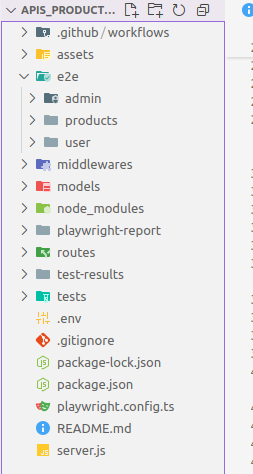

# APIs_Products_Admin_User ☕
😜 Nodejs&Expressjs => JavaScript 💛 / MongoDB 💚 / JWT 🔐
## :cactus:Overview

This project is a backend API built with **Node.js** and **Express**. It uses **MySQL** with Sequelize for database management, and **MongoDB** with Mongoose for certain data models. Security is handled with **bcrypt** for password hashing and **jsonwebtoken** for authentication. File uploads are managed by **multer**.

---

## :black_flag:Features

- RESTful API endpoints for various resources
- Data validation using **Joi**
- Authentication with JWT tokens
- Password hashing with **bcrypt**
- File upload support
- MySQL and MongoDB integration
- Comprehensive API tests with **Playwright**

---
## 📁 Project Structure

## 🧪 Testing 

### 📬 Manual API Testing

All API endpoints are first tested manually using **Postman** to ensure they behave correctly.

### 🎭 Automated Testing with Playwright

Automated end-to-end API tests are implemented using **Playwright**. These tests simulate real user interactions and verify API behavior.


## 🦩 API Testing with Playwright

This project uses **Playwright** to automate API testing.

Example test:
```ts
test.describe('Admin creates a product', () => {
  test.beforeAll(async ({ request }) => {
    const res = await request.post('/admin/login', {
      data: { email: 'admin@example.com', password: 'secret' },
    });
    token = (await res.json()).token;
  });

  test('Create product with valid data', async ({ request }) => {
    const res = await request.post('/product/add', {
      data: {
        nameProduct: "Coffee",
        Description: "Roasted coffee beans",
        priceProduct: 10,
        image: "https://example.com/coffee.jpg"
      },
      headers: { Authorization: `Bearer ${token}` },
    });
    expect(res.status()).toBe(201);
  });
});
```

✅ Authenticates with admin  
✅ Sends authorized request  
✅ Asserts response status and content

Playwright lets you test your APIs quickly in CI without needing a browser.

## 💻 How to run locally 

1. Clone the repository  
   `git clone https://github.com/yourusername/api.git`

2. Install dependencies  
   `npm install`

3. Create a `.env` file and add your environment variables (database credentials, JWT secret, etc.)😜🔑

4. Start the server  
   `node server.js`

5. Run tests  
   `npm test`

---

## Author

🍀 Salhi Fayza